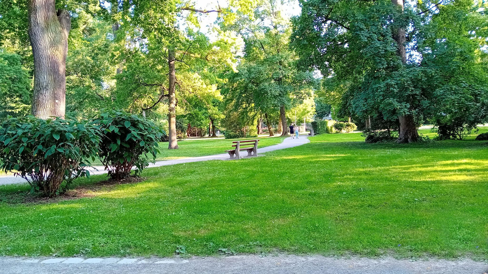

## Bilder in KnitR - RMarkdown
In diesem Ordner findet man Demobilder, die für die Demostration der Einbindung von Bildern in eine R-Markdowndatei verwendet werden.
Bilder werden in diesem Github-Repository in dem Unterverzeichnis `img/` abgespeichert. 

 
