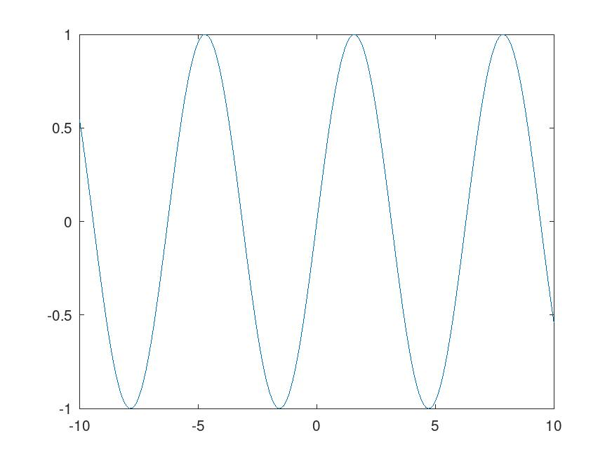

```{r setup, include=FALSE}
knitr::opts_chunk$set(echo = TRUE)
```

## R Markdown and GNU Octave

This is an R Markdown document, that used [Octave](https://octave.org/) (see <https://octave.org/>). Markdown is a simple formatting syntax for authoring HTML, PDF, and MS Word documents, that can include code, when you use [KnitR](https://en.wikiversity.org/wiki/KnitR). For more details on using R Markdown see <http://rmarkdown.rstudio.com>.

When you click the **Knit** button a document will be generated and the included  Octave code will be executed (similar to R code chunks). KnitR needs to know, where Octace is located in the file system to be execute during a KnitR run. After generation of output from Octave (e.g. a figure) the results in file can be included in the KnitR document (e.g. import a graph or diagram).  You can embed an Octave code with a code chunk similar to code chunks in R:

This text above is pure text before code chunk in Octave.
```{octave,engine.path='/usr/bin/octave',results='asis',echo=TRUE}
  x = -10:0.1:10;
  plot (x, sin (x)); 
  print -djpg ./myfigure.jpg 
```
After the execution of the code chunk the generated image by Octave in available as file `myfigure.jpg` in the same directory of the R-Markdown document. The following R-Markdown code imports the generated figure "myfigure.jpg" in the document.


## Plots in R
In comparison to a plot in R a path to the R engine is not necessary.
Plotting of pressure data genefrates the plot and not embedding of the generated figure is not necessary. 

```{r pressure, echo=FALSE}
plot(pressure)
```

Note that the `echo = FALSE` parameter was added to the code chunk to prevent printing of the R code that generated the plot.
